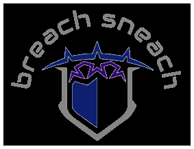

BreachSneach

BreachSneach е проекта на TariCAD sistema за Hack Tues 9.

Автори:

    Андрей Ежков - 11 Г клас
    Димитър Милчев - 10 А клас
    Викторио Миланов - 11 Г клас

Проектът е концепция за prediction на кибер атаки и security breach-ове. Използваните технологии са:

    NextJS
    Python
    React
    Tensorflow
    
Начин на работа:

    Потребителя избира в какъв сектор ще създава проект и AI му дава възможни начини за пробиви в бъдеще.
